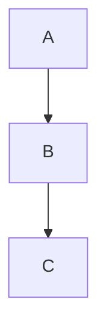

# @ysuzuki19/remark-mermaid

remark plugin for mermaid in markdown.

# install

```bash
$ npm i @ysuzuki19/remark-mermaid mermaid
```

## use

```typescript
import remarkMermaid from '@ysuzuki19/remark-mermaid';

...

async function main() {
  await unified()
    .use(remarkMermaid)
    .process(...)
}
```

For visualize mermaid, you must to run `mermaid.init();` in frontend code.

Because this plugin only transform mermaid code block into `<div class="mermaid">`.

## markdown -> html

````markdown

````

```html
<div class="mermaid">graph TD; A-->B; B-->C;</div>
```
